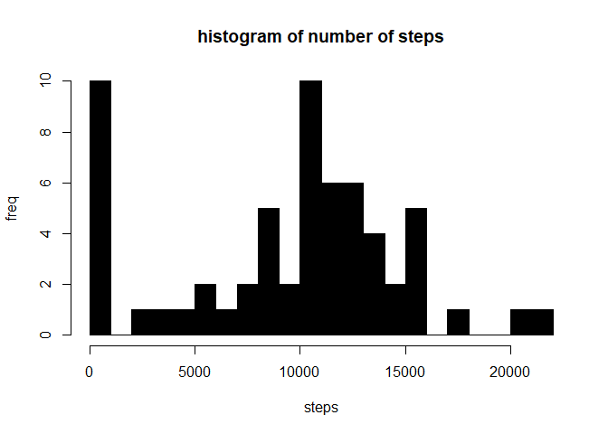
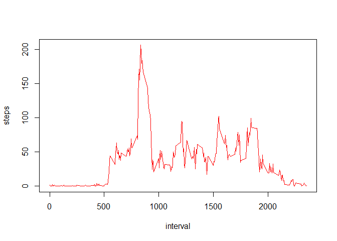

## Loading and preprocessing the data
In the following code we try to load the required packages,read the data from the csv file and clean the data

```r
setwd("~/github/RepData_PeerAssessment1")
#setwd("~/git/RepData_PeerAssessment1")
library(lubridate)
```

```
## Warning: package 'lubridate' was built under R version 3.5.1
```

```
## 
## Attaching package: 'lubridate'
```

```
## The following object is masked from 'package:base':
## 
##     date
```

```r
activity <- read.csv("activity.csv")
activity$date <- ymd(activity$date)
activity <- activity[!is.na(activity$steps), ]
```

## What is mean total number of steps taken per day?
We use tapply function to find the sum of the steps with respect to the date and then use a histogram plot to plot the data


```r
act_sum <- tapply(activity$steps,activity$date,sum)
hist(act_sum
     ,col = "black"
     ,breaks = 20
     ,xlab = "steps"
     ,ylab = "freq"
     ,main = "histogram of number of steps")
```

<!-- -->

```r
median(activity$interval)     #finding the median 
```

```
## [1] 1177.5
```

```r
mean(activity$interval)       #finding the mean
```

```
## [1] 1177.5
```


## What is the average daily activity pattern?
Finding the average of steps with respect to the interval and creating a time series plot

```r
steps <- tapply(activity$steps,activity$interval,mean)
steps1 <- data.frame(step=steps,interval=as.numeric(names(steps)))
rownames(steps1) <- (1:length(steps1$step))
plot(steps1$step~steps1$interval
     ,type="l"
     ,col="red"
     ,xlab="interval"
     ,ylab="steps")
```

<!-- -->

## Imputing missing values


## Are there differences in activity patterns between weekdays and weekends?
