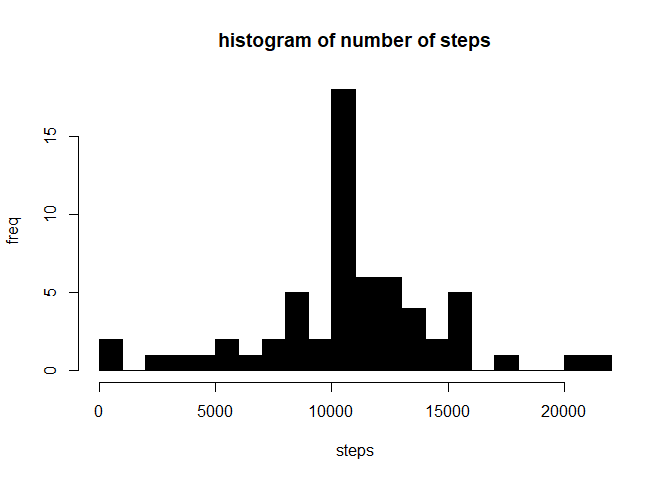

## Loading and preprocessing the data
In the following code we try to load the required packages,read the data from the csv file and clean the data

```r
setwd("~/github/RepData_PeerAssessment1")
#setwd("~/git/RepData_PeerAssessment1")
library(lubridate)
```

```
## Warning: package 'lubridate' was built under R version 3.5.1
```

```r
activity <- read.csv("activity.csv")
activity$date <- ymd(activity$date)
activity <- activity[!is.na(activity$steps), ]
```

## What is mean total number of steps taken per day?
We use tapply function to find the sum of the steps with respect to the date and then use a histogram plot to plot the data


```r
act_sum <- tapply(activity$steps,activity$date,sum)
hist(act_sum
     ,col = "black"
     ,breaks = 20
     ,xlab = "steps"
     ,ylab = "freq"
     ,main = "histogram of number of steps")
```

<!-- -->

```r
median(act_sum)     #finding the median 
```

```
## [1] 10765
```

```r
mean(act_sum)       #finding the mean
```

```
## [1] 10766.19
```


## What is the average daily activity pattern?
Finding the average of steps with respect to the interval and creating a time series plot

```r
steps <- tapply(activity$steps,activity$interval,mean)
steps1 <- data.frame(step=steps,interval=as.numeric(names(steps)))
rownames(steps1) <- (1:length(steps1$step))
plot(steps1$step~steps1$interval
     ,type="l"
     ,col="red"
     ,xlab="interval"
     ,ylab="steps")
```

<!-- -->

## Imputing missing values
In this step we are trying to fill in all the NA with a value i,e. filling all the NA with the average of the values of step with respective to the interval removing NA while calculating averge.

```r
missing <- read.csv("activity.csv")
missing$date <- ymd(missing$date)
dim(missing)
```

```
## [1] 17568     3
```

```r
sum(is.na(missing))     #Total missing values in the data set
```

```
## [1] 2304
```

```r
for (i in 1:length(missing$steps)) {
  if(is.na(missing$steps[i]))
  {
    missing$steps[i] <- mean(missing$steps[missing$interval==missing$interval[i]],na.rm = TRUE)
  }
  
  
}
dim(missing)                  #dimension of data after filling in NA
```

```
## [1] 17568     3
```

```r
sum(is.na(missing))
```

```
## [1] 0
```

```r
missing_sum <- tapply(missing$steps,missing$date,sum)
hist(missing_sum
     ,col = "black"
     ,breaks = 20
     ,xlab = "steps"
     ,ylab = "freq"
     ,main = "histogram of number of steps")
```

<!-- -->

```r
median(missing_sum)     #finding the median 
```

```
## [1] 10766.19
```

```r
mean(missing_sum)       #finding the mean
```

```
## [1] 10766.19
```
## Are there differences in activity patterns between weekdays and weekends?
